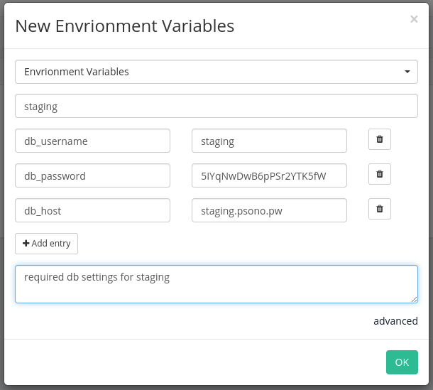
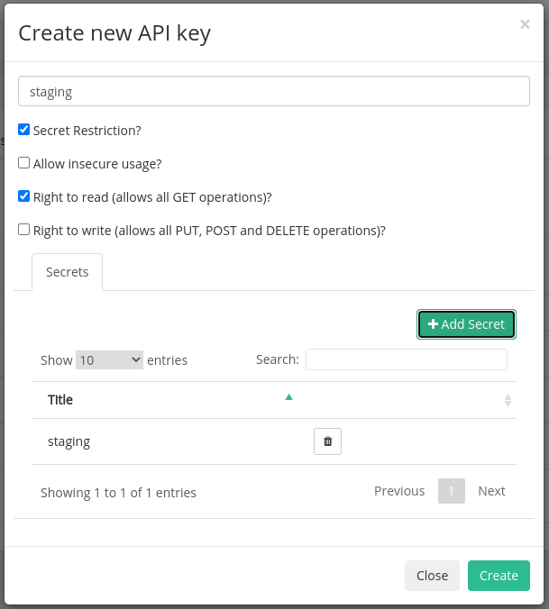

# psonoci

[PSONO](https://psono.com/) CI client.

PSONO is a secure Open Source Password Manager, which can be self hosted by anyone so you have to trust no one.

`psonoci` allows a secure access to your psono passwords (and other values) within your CI process.

## Usage

`psonoci --help`

```
psonoci 0.2.0
Bernd Kaiser
Psono ci client

USAGE:
    psonoci [FLAGS] [OPTIONS] --api-key-id <api-key-id> --api-secret-key-hex <api-secret-key-hex> --server-url <server-url> <SUBCOMMAND>

FLAGS:
        --danger-disable-tls-verification    DANGER: completely disables all TLS (common name and certificate)
                                             verification. You should not use this. A better approach is just using
                                             plain http so there's no false sense of security (Psono secrets are still
                                             authenticated)
    -h, --help                               Prints help information
        --use-native-tls                     Use native TLS implementation (for linux musl builds a vendored openssl
                                             1.1.1j is used)
    -V, --version                            Prints version information

OPTIONS:
        --api-key-id <api-key-id>                                  Api key as uuid [env: PSONO_CI_API_KEY_ID=]
        --api-secret-key-hex <api-secret-key-hex>
            Api secret key as 64 byte hex string [env: PSONO_CI_API_SECRET_KEY_HEX=]

        --config-packed <config_packed>
            psonci config as packed string [env: PSONO_CI_CONFIG_PACKED=]

    -c, --config-path <config_path>
            psonoci config path [env: PSONO_CI_CONFIG_PATH=psonoci.toml]

        --der-root-certificate-path <der-root-certificate-path>
            Path to a DER encoded root certificate which should be added to the trust store [env:
            PSONO_CI_ADD_DER_ROOT_CERTIFICATE_PATH=]
        --max-redirects <max-redirects>
            Maximum numbers of redirects [env: PSONO_CI_MAX_REDIRECTS=]  [default: 0]

        --pem-root-certificate-path <pem-root-certificate-path>
            Path to a pem encoded root certificate which should be added to the trust store [env:
            PSONO_CI_ADD_PEM_ROOT_CERTIFICATE_PATH=]
        --server-url <server-url>
            Url of the psono backend server [env: PSONO_CI_SERVER_URL=]

        --timeout <timeout>
            Connection timeout in seconds [env: PSONO_CI_TIMEOUT=]  [default: 60]


SUBCOMMANDS:
    api-key    Psono api-key inspect (/api-key-access/inspect/)
    config     config commands (create, save, pack,...)
    help       Prints this message or the help of the given subcommand(s)
    run        run spawns processes with environment vars from the api-keys secrets
    secret     Psono secret commands (/api-key-access/secret/)
```

### Required Options

These three options must be supplied (and be in front of the subcommand):

| Option                   | Env var                     | Type               | Required | Default | Description                                                               |
| ------------------------ | --------------------------- | ------------------ | -------- | ------- | ------------------------------------------------------------------------- |
| --api_key_id             | PSONO_CI_API_KEY_ID         | UUID               | yes      | None    | The UUID of your API key                                                  |
| --api_key_secret_key_hex | PSONO_CI_API_SECRET_KEY_HEX | 64 byte hex string | yes      | None    | Secret key used for decryption of the user's secret key                   |
| --server_url             | PSONO_CI_SERVER_URL         | URL                | yes      | None    | Address of the PSONO's backend server - e.g.: https://www.psono.pw/server |

There are several more options, please use the `help` commands for more info.

## Run With Protected Environments

`psonoci` can now inject environment variables from your secrets right into you programs!

First create a new secret of the type "`Environment Variables`":



Then add this secret to your api key



and afterwards run:

```sh
psonoci -c /path/to/config-staging.toml run -- ./my_backend.py --timeout 10
```

This command will execute `./my_backend.py` and inject all environment variables of all secrets into the process:

```py
#!/usr/bin/python3

# content of my_backend.py
import os
import sys

print("args: {}".format(sys.argv))
print("environment: {}".format(os.environ))
```

Would return:

```
args: ['my_backend.py', '--timeout', '60']
environment: environ({'db_host': 'staging.psono.pw', 'db_password': '5IYqNwDwB6pPSr2YTK5fW', 'db_username': 'staging'})
```

## Config

`psonoci` can also be configured with a config file or config string.

### Config File

```sh
psonoci \
    --api-key-id 00000000-0000-0000-0000-000000000000 \
    --api-secret-key-hex 0000000000000000000000000000000000000000000000000000000000000000 \
    --server-url 'https://psono.pw/server' \
    config save /tmp/psonoci.toml
```

Creates the following config file at `/tmp/psonoci.toml`

```toml
version = "1"

[psono_settings]
api_key_id = "00000000-0000-0000-0000-000000000000"
api_secret_key_hex = "0000000000000000000000000000000000000000000000000000000000000000"
server_url = "https://psono.pw/server/"

[http_options]
timeout = 60
max_redirects = 0
use_native_tls = false
danger_disable_tls_verification = false
```

The config file then can be loaded with:

```sh
psonoci -c /path/to/config.toml config show
```

or be supplied by an environment variable

```sh
PSONO_CI_CONFIG_PATH="/path/to/config.toml" psonoci config show
```

### Config String

If you don't want to use files to load the config there is also the option to load the config from a base58 encoded string which can be supplied as an environment variable.

```sh
psonoci \
    --api-key-id 00000000-0000-0000-0000-000000000000 \
    --api-secret-key-hex 0000000000000000000000000000000000000000000000000000000000000000 \
    --server-url 'https://psono.pw/server' \
    config pack
```

Returns this string :

```
5dtuTPxg1kDP3Qoz2HKbMxT4kDqTYxbUo8mxR9yEp7YNSYq6dP8Gv4ysoVAjW8qS2iYwEaRm9NxzpbSXuwwXL45aHLiWi8TBSee3KnitgJPGyiuGCREGibB2pVCPCVg1zb11TpsbKuzV3aGhqQyE1NJnYwo9qrVjw6P
```

which than can be used with:

```sh
psonoci \
    --config-packed="5dtuTPxg1kDP3Qoz2HKbMxT4kDqTYxbUo8mxR9yEp7YNSYq6dP8Gv4ysoVAjW8qS2iYwEaRm9NxzpbSXuwwXL45aHLiWi8TBSee3KnitgJPGyiuGCREGibB2pVCPCVg1zb11TpsbKuzV3aGhqQyE1NJnYwo9qrVjw6P" \
    config show
```

or

```sh
PSONO_CI_CONFIG_PACKED="5dtuTPxg1kDP3Qoz2HKbMxT4kDqTYxbUo8mxR9yEp7YNSYq6dP8Gv4ysoVAjW8qS2iYwEaRm9NxzpbSXuwwXL45aHLiWi8TBSee3KnitgJPGyiuGCREGibB2pVCPCVg1zb11TpsbKuzV3aGhqQyE1NJnYwo9qrVjw6P" psonoci config show
```

## Supported secret types:

-   Website
-   Application
-   Note
-   GPGKey
-   Bookmark
-   Environment Variables

## CI/CD Usage Example

TODO

<!-- See [ci.sh](./examples/ci.sh) for an example script on how to use `psonoci` during your CI/CD process. -->

## Build

### Rust native

If you have rust installed just run `cargo build --release`.

The current version is tested with Rust `1.51`.

### cross

[cross](https://github.com/rust-embedded/cross) (which uses `docker`) is used to cross compile `psonoci` to several architectures.

After you installed `cross` just run:

```sh
cross build --target aarch64-unknown-linux-musl --release
```

`Cross.toml` defines which docker images are used to compile the binary. The images itself are build with the `Dockerfile`s located in `./build_files`.

## Supported Architectures

-   x86_64-unknown-linux-gnu
-   x86_64-unknown-linux-musl
-   x86_64-pc-windows-msvc
-   x86_64-pc-windows-gnu
-   x86_64-apple-darwin
-   aarch64-unknown-linux-musl
-   armv7-unknown-linux-gnueabihf
-   ~~armv7-unknown-linux-musleabihf~~

Sadly I have to drop support for `armv7-unknown-linux-musleabihf` until Rust is able to link against `MUSL v1.2.2`.

Falling back to `MUSL <=1.1` is no longer an option because of [CVE-2020-28928](https://www.openwall.com/lists/musl/2020/11/19/1)

I am not sure if `aarch64-apple-darwin` is also supported (I think it should work). So if there are any Apple M1 users out there please let me know.

## Install

Download `psonoci` binary, make executable (`chmod +x psonoci`), and place into a directory which is part of your `$PATH`.

## Key Setup

TODO

<!-- ### Create API Key

1. Go to `Other -> API Keys` and click `Create new API Key`.
2. Name your API key and make sure neither `Secret Restriction?` nor `Allow insecure usage?` are activated. (see Image )
3. Click Create
4. In the API key overview click on the edit Icon for the newly created key
5. In this view you will see all secrets you need for the `psoco` config (see image 2)

#### Create API Key


#### View API Key

 -->

## License

[The MIT License](https://opensource.org/licenses/MIT)

Copyright (c) 2020, 2021 Bernd Kaiser
